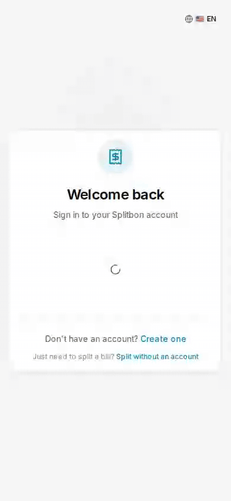
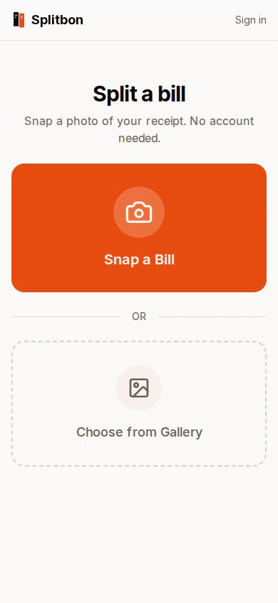
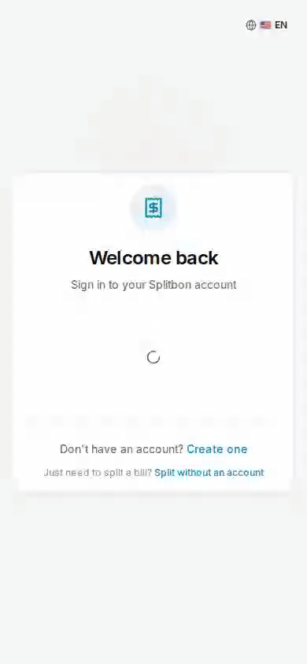

<p align="center">
  
</p>

<h1 align="center">Splitbon</h1>

<p align="center">
  <b>Split trip costs with friends. On your own server.</b><br />
  Photograph a receipt, let AI read and translate it, tap who had what, settle up in one currency.
</p>

<p align="center">
  <a href="LICENSE"></a>
  
  
  <a href="https://ko-fi.com/aks"></a>
</p>

<p align="center">
  <a href="#get-started">Get started</a> &middot;
  <a href="#what-it-does">What it does</a> &middot;
  <a href="#how-it-compares">Comparison</a> &middot;
  <a href="#see-it-in-action">Screenshots</a> &middot;
  <a href="#documentation">Docs</a>
</p>

<p align="center">
  
  &nbsp;&nbsp;
  
</p>

---

## Why Splitbon

You come back from a trip with a pile of receipts in three currencies and no wish to hand your spending history to a company. Splitbon is a small web app you host yourself (Docker, Unraid, any Linux box) that turns that pile into a short list of who pays whom.

- **Yours.** Your server, your database, no ads, no daily limit on expenses.
- **Built for travel.** Pay in any currency; every amount is also shown in the group currency, and the trip's currency is offered first.
- **Reads foreign receipts.** A bill in Thai, Arabic or Japanese comes back in your language, with the shop name left as printed.
- **Fair to the cent.** Assign single line items, or split equally, by amount, percentage or shares. Tax and tip are spread in proportion.
- **No lock-in.** MIT licensed, plain PostgreSQL, full data export in the admin area.

## Get started

Splitbon runs as one Docker container with PostgreSQL included.

```bash
git clone https://github.com/cyborcc/splitbon.git
cd splitbon/docker
cp ../.env.example .env
```

Open `.env` and set `NEXTAUTH_SECRET` and `AUTH_SECRET` (generate each with `openssl rand -base64 32`), then:

```bash
docker compose up -d --build
```

Splitbon is now running at <http://localhost:3000>. To scan receipts, connect an AI provider in `.env` or in the admin dashboard; see [Configuration](docs/configuration.md#ai-receipt-scanning).

### On Unraid

Add the template by hand (a Community Apps listing is in the works): paste

`https://raw.githubusercontent.com/cyborcc/splitbon/main/unraid/splitbon.xml`

into the template field of _Docker → Add Container_ and fill in `AUTH_SECRET` and `NEXTAUTH_SECRET`. The template pulls `ghcr.io/cyborcc/splitbon:stable`; updates arrive through _Check for Updates_.

Backups, upgrades and prebuilt image tags are covered in [Upgrading and backups](docs/upgrading.md).

## What it does

|                         |                                                                                                                                           |
| ----------------------- | ----------------------------------------------------------------------------------------------------------------------------------------- |
| 🧾 **Receipt scanning** | Photo in, line items out. Rescan with a correction hint, pick the model per receipt, review AI corrections before they are applied.       |
| 🌍 **Multi-currency**   | ECB exchange rates for the day of the expense, or enter your own. Receipts keep the rate with its source and date.                        |
| 🤝 **Claim links**      | Share a scanned receipt; everyone picks their own items, split dishes between people, join as a couple. No account needed for guests.     |
| 📍 **Places & maps**    | Add where you paid: OpenStreetMap search, GPS, places nearby, a mini map on every expense.                                                |
| 📊 **Trip statistics**  | Totals, categories, timeline, people, map, budget and a daily-cost forecast.                                                              |
| 🔔 **Notifications**    | In-app bell plus web push when you are part of a new expense, a price or your share changes, or someone pays you back.                    |
| 🔒 **Private expenses** | Only the payer sees title and amount.                                                                                                     |
| 🧮 **Settle up**        | Debts are simplified to as few payments as possible; paying records the settlement. Optional Venmo links for US groups.                   |
| 🌐 **9 languages**      | English, Spanish, Swedish, French, German, Portuguese (BR), Japanese, Chinese, Korean. Dark mode included.                                |
| 🛠️ **Admin & sign-in**  | Users, groups, audit log, announcements, server logs, data export. Email/password, magic link, or SSO through Authentik, Keycloak and co. |
| 📱 **Installable**      | Works as a PWA on your phone's home screen.                                                                                               |
| 🧩 **Pluggable AI**     | OpenAI, ChatGPT subscription, Claude, Meridian (Claude subscription), Swisscom myAI, or local Ollama.                                     |

Splitbon also has a built-in **How it works** page with short videos, and a feedback page that turns a report into a prefilled GitHub issue.

## How it compares

✅ yes · ⚠️ partly, paid, or needs setup · ❌ no · ➖ not documented

|                     | Splitbon | Splitwise | Tricount | Splid | Spliit | SplitPro |
| ------------------- | :------: | :-------: | :------: | :---: | :----: | :------: |
| Self-hosted         |    ✅    |    ❌     |    ❌    |  ❌   |   ✅   |    ✅    |
| Open source         |    ✅    |    ❌     |    ❌    |  ❌   |   ✅   |    ✅    |
| Free without limits |    ✅    |    ⚠️     |    ✅    |  ✅   |   ✅   |    ✅    |
| AI receipt scan     |    ✅    |    ⚠️     |    ➖    |  ➖   |   ⚠️   |    ➖    |
| Translates receipts |    ✅    |    ➖     |    ➖    |  ➖   |   ➖   |    ➖    |
| Several currencies  |    ✅    |    ⚠️     |    ✅    |  ✅   |   ➖   |    ✅    |
| Push notifications  |    ✅    |    ➖     |    ➖    |  ➖   |   ➖   |    ✅    |
| Native mobile app   |    ❌    |    ✅     |    ✅    |  ✅   |   ❌   |    ❌    |

Splitwise's free plan has a daily expense limit and ads, and keeps receipt scanning and currency conversion in Pro. Spliit scans receipts only after you set up S3 storage and an OpenAI key. Splitbon, Spliit and SplitPro are web apps (installable as a PWA); the rest ship native apps.

If you just need to split one bill right now, a hosted app is quicker. If you want to keep the data, scan with your own AI key, or run it for friends and family at home, that is what Splitbon is for. The table follows each project's own site or README as of October 2026; these things change, so please check before deciding, and send a pull request if something is off.

## See it in action

<table>
  <tr>
    <td align="center" width="33%"><br /><sub>Dashboard</sub></td>
    <td align="center" width="33%"><br /><sub>Add an expense</sub></td>
    <td align="center" width="33%"><br /><sub>Split modes</sub></td>
  </tr>
  <tr>
    <td align="center"><br /><sub>Settle up</sub></td>
    <td align="center"><br /><sub>Guest split, no account</sub></td>
    <td align="center"><br /><sub>Invite by link</sub></td>
  </tr>
  <tr>
    <td align="center"><br /><sub>Create a group</sub></td>
    <td align="center"><br /><sub>Group settings</sub></td>
    <td align="center"><br /><sub>Dark mode</sub></td>
  </tr>
  <tr>
    <td align="center"><br /><sub>9 languages</sub></td>
    <td align="center"><br /><sub>Venmo links (optional)</sub></td>
    <td align="center"><br /><sub>Admin dashboard</sub></td>
  </tr>
</table>

## Documentation

| Guide                                      | What is in it                                                                      |
| ------------------------------------------ | ---------------------------------------------------------------------------------- |
| [Configuration](docs/configuration.md)     | Every environment variable: AI providers, SSO/OIDC, magic link, SMTP, rate limits. |
| [Upgrading and backups](docs/upgrading.md) | Backing up, updating, prebuilt image tags (`stable` / `latest`), database notes.   |
| [Development](docs/development.md)         | Tech stack, local setup, tests, how releases work.                                 |
| [Contributing](CONTRIBUTING.md)            | Pull request guidelines and code style.                                            |
| [Security](SECURITY.md)                    | How to report a vulnerability.                                                     |

Found a bug or have an idea? [Open an issue](../../issues), or use the feedback page inside the app.

## Support

Splitbon is free and stays free. If it saved your trip budget, you can [buy me a beer on Ko-fi](https://ko-fi.com/aks) 🍻, or just star the repo.

## Credits and license

Splitbon grew out of [ShareTab](https://github.com/sw-carlos-cristobal/sharetab) by sw-carlos-cristobal and contributors, and keeps its MIT license. On top of it come trip currencies, receipt translation, places and maps, statistics, notifications and more. Released under the [MIT License](LICENSE).
